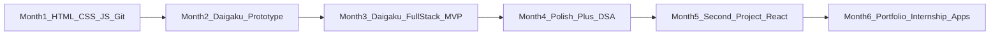
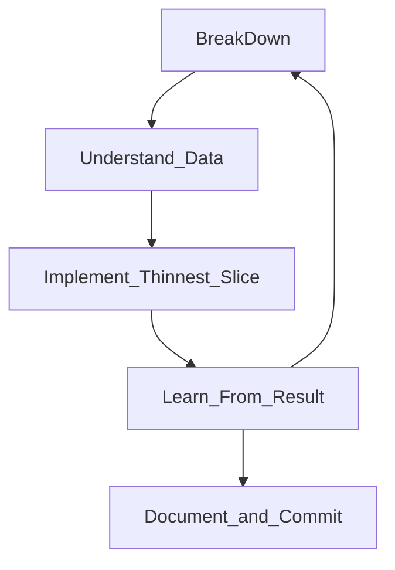
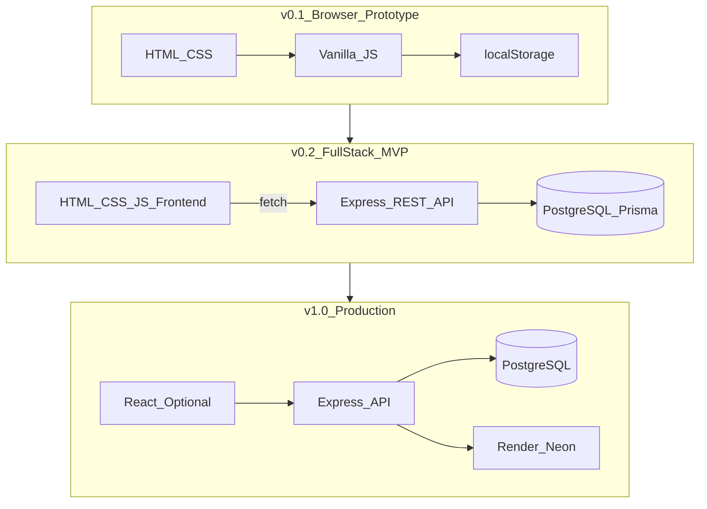

# Hitesh — Developer Roadmap and Daigaku Master Plan

## Part 1: Honest skill assessment

**Where you are today (Stage 2 of 6 — "Can read, cannot yet architect")**

| Strength | Evidence | What it means |
|----------|----------|---------------|
| HTML/CSS | Fairly well | You can structure pages and style them — this is further than many second-year students |
| Basic JS | Can solve simple problems | You understand syntax and logic, but not yet how JS fits into a multi-file app |
| Code comprehension | Good when explained | You learn by understanding, not memorizing — this is the right mindset |
| Project completion | Struggles | The gap is not intelligence; it is **decomposition** and **sequencing** |

**What you are missing (and that is normal):**

- **Problem decomposition** — breaking "build Daigaku" into tasks small enough to finish in one sitting
- **Mental models** — client vs server, request/response, database as persistent storage
- **Workflow habits** — Git commits, running one feature at a time, testing before moving on
- **Confidence to start** — you wait for the "perfect" plan instead of building the smallest thing

**What you should NOT do:**

- Jump to React + Node + PostgreSQL + AI on day 1
- Copy-paste AI code you cannot explain line-by-line
- Treat Daigaku's full feature list as your MVP scope

**Your unfair advantage:** You already have a real project idea you care about. Most students build todo apps. Daigaku gives you motivation — use it, but build it in layers.

---

## Part 2: Skills to learn — order, why, and when

Learn in this sequence. Each skill unlocks the next.

### Tier 1 — Foundation (you are mostly here)

| # | Skill | Why it matters | Learn when | Time |
|---|-------|----------------|------------|------|
| 1 | **HTML semantics** | Correct structure = accessible, SEO-friendly, easier JS | Now (refresh) | 2-3 days |
| 2 | **CSS layout (Flexbox + Grid)** | Every dashboard, timetable, and form depends on layout | Now (refresh) | 3-5 days |
| 3 | **JavaScript fundamentals** | Variables, functions, arrays, objects, loops, conditionals — the language of everything after | Week 1 | 1-2 weeks |
| 4 | **DOM manipulation** | Connect buttons and forms to behavior without a framework | Week 1-2 | 3-5 days |
| 5 | **Git basics** | Every internship expects version control; saves you from "it broke and I can't go back" | Week 1 | 2-3 days |

### Tier 2 — Browser application thinking

| # | Skill | Why it matters | Learn when | Time |
|---|-------|----------------|------------|------|
| 6 | **Events and forms** | Login, add subject, edit profile — all are form + event flows | Week 2 | 2-3 days |
| 7 | **fetch / HTTP basics** | How browser talks to server; foundation of all APIs | Week 3-4 | 3-5 days |
| 8 | **JSON** | Data format between frontend and backend | Week 3-4 | 1 day |
| 9 | **localStorage (temporary)** | Build a working prototype before database complexity | Week 3 | 2-3 days |
| 10 | **Debugging (console, DevTools)** | Professionals spend 30% of time debugging — learn early | Ongoing | Daily habit |

### Tier 3 — Backend and persistence

| # | Skill | Why it matters | Learn when | Time |
|---|-------|----------------|------------|------|
| 11 | **Node.js + npm** | Run JavaScript on the server; manage packages | Week 4 | 2-3 days |
| 12 | **Express.js** | Standard way to build REST APIs in JS ecosystem | Week 4-5 | 1 week |
| 13 | **SQL + relational thinking** | Tables, rows, foreign keys — academic data is relational | Week 5 | 1-2 weeks |
| 14 | **Prisma ORM** | Define schema, run migrations, query without raw SQL overload | Week 5 | 3-5 days |
| 15 | **Environment variables** | Secrets (DB URL, JWT key) never go in code | Week 5 | 1 day |

### Tier 4 — Production patterns

| # | Skill | Why it matters | Learn when | Time |
|---|-------|----------------|------------|------|
| 16 | **Authentication (JWT + bcrypt)** | Every multi-user app needs login; interview favorite topic | Week 5-6 | 1 week |
| 17 | **REST API design** | GET/POST/PUT/DELETE, status codes, nested routes | Week 6 | Ongoing |
| 18 | **Validation + error handling** | Bad data breaks GPA calculations; users need clear errors | Week 7 | 3-5 days |
| 19 | **Deployment** | A live URL on your resume beats 10 localhost projects | Week 8 | 2-3 days |
| 20 | **Basic testing** | Proves your SGPA logic is correct; shows maturity | Week 7-8 | 3-5 days |

### Tier 5 — Internship-ready extras (after Daigaku MVP)

| # | Skill | Why it matters | Learn when |
|---|-------|----------------|------------|
| 21 | **React** | Most frontend internships list it; learn after you understand APIs | Month 3+ |
| 22 | **Data structures & algorithms** | Indian internship pipelines (Amazon, Microsoft, startups) test DSA | Month 2+ daily |
| 23 | **System design basics** | "How would you scale this?" in interviews | Month 4+ |
| 24 | **CI/CD (GitHub Actions)** | Shows you understand professional workflow | Month 3+ |

### Explicitly defer (not now)

- Docker, Kubernetes, microservices
- GraphQL, Redis, message queues
- AI/ML features inside Daigaku
- Game development (explore after web fundamentals — Godot uses similar logic)

---

## Part 3: Career roadmap — beginner to internship-ready

**Timeline: ~6 months** at 2-3 focused hours/day (realistic for a second-year student).



### Stage 1 — Solidify frontend + Git (Month 1, Weeks 1-2)

**Project:** Static Daigaku pages (no JS backend)

**Milestones:**
1. Landing page with project description
2. Login/register page layout (non-functional)
3. Dashboard layout with fake data in HTML
4. Semester list + subject table (hardcoded)
5. Git repo with meaningful commits ("Add dashboard layout", not "update")

**Done when:** 4-5 linked HTML pages, consistent CSS, on GitHub

---

### Stage 2 — JavaScript prototype (Month 1, Weeks 3-4)

**Project:** Daigaku v0.1 — browser-only, localStorage

**Why this step exists:** You prove GPA logic and UX **before** Node, databases, and auth. If you cannot make CGPA work in 30 lines of JS, a database will not fix it.

**Milestones:**
1. Add semester form saves to localStorage
2. Add subjects under a semester
3. SGPA/CGPA calculator (pure functions, tested manually)
4. Dashboard reads from localStorage and displays GPA
5. Export/import JSON backup (optional but impressive)

**Done when:** Full flow works in browser with no server; you can explain every function

---

### Stage 3 — Full-stack Daigaku MVP (Month 2-3)

**Project:** Replace localStorage with Express API + PostgreSQL

**Milestones:** See Part 6 (Daigaku architecture) and Part 8 (30-day plan)

**Done when:** Login works, data persists in DB, dashboard shows real SGPA/CGPA, live URL exists

---

### Stage 4 — Polish + DSA (Month 4)

**Split your time: 60% Daigaku improvements, 40% DSA**

- Add attendance, assignments, or notes (pick 2)
- Write README with architecture diagram
- Start daily DSA: 1-2 problems (Striver A2Z or NeetCode roadmap)
- Fix bugs, improve mobile layout

**Done when:** Recruiter can use demo account without your help

---

### Stage 5 — Second project + React (Month 5)

**Why a second project:** One project looks like a tutorial follow-along. Two projects show you can repeat the process.

**Suggested second projects (pick one, small scope):**
- **Expense tracker** — reinforces CRUD + charts
- **Quiz app** — reinforces auth + timed logic
- **DevNotes** — markdown notes with tags (reuse file upload skills)

**React:** Rebuild Daigaku dashboard as a React frontend talking to your existing API. Do not restart backend.

**Done when:** React SPA deployed, second project on GitHub

---

### Stage 6 — Internship push (Month 6)

- Resume: 2 projects with live links, tech stack, your role
- LinkedIn + GitHub profile polished
- Apply to 5-10 internships/week (startups, remote, off-campus)
- Mock interviews: explain Daigaku architecture in 3 minutes
- Contribute 2-3 issues to open source (good signal, optional)

---

## Part 4: How professional developers think

### The BUILD loop (use this for every feature)



1. **Break down** — Write the feature as 3-5 tasks each completable in under 2 hours
2. **Understand data** — What inputs? What outputs? What gets stored? Draw on paper first
3. **Implement thinnest slice** — Make one path work end-to-end (e.g., create semester only, no edit/delete yet)
4. **Learn from result** — Run it, break it, fix it. Do not start next feature until this works
5. **Document and commit** — One commit per logical change; update a simple CHANGELOG or README

### Questions developers ask before writing code

For every Daigaku feature, answer these on paper:

1. **Who uses this?** (Student only for MVP)
2. **What triggers it?** (Button click, page load, form submit)
3. **What data is needed?** (Fields, types, validation rules)
4. **Where does data live?** (localStorage → later database table)
5. **What does success look like?** (User sees X; DB contains Y)
6. **What can go wrong?** (Empty form, duplicate semester, marks > max)

### The "vertical slice" rule

Amateurs build **horizontally**: all database tables first, then all APIs, then all UI.

Professionals build **vertically**: one feature from UI → API → DB → back to UI, then the next feature.

**Example for Daigaku "Add Semester":**
- Day A: HTML form + button (no backend)
- Day B: API endpoint saves to DB
- Day C: Wire form to API with fetch
- Day D: List page shows semesters from API

Not: design 12 tables → build 40 endpoints → wonder why nothing works.

---

## Part 5: From idea to working project

### Step 1 — One-sentence product

> Daigaku helps students track semester-wise marks and automatically calculate SGPA and CGPA.

If a feature does not serve that sentence in MVP, cut it.

### Step 2 — User story (MVP)

> As a student, I want to log my subject marks per semester so that I can see my SGPA and CGPA without manual calculation.

### Step 3 — Data model on paper

Draw boxes: User → StudentProfile → Semester → Subject. Arrows show relationships. This becomes your database schema later.

### Step 4 — Screen list (MVP only)

1. Login / Register
2. Dashboard (GPA summary)
3. Semesters (list + add)
4. Subjects (list + add, inside a semester)

Four screens. Not seventeen.

### Step 5 — Build order (dependency order)

Auth → Profile → Semester → Subject → GPA logic → Dashboard

### Step 6 — Definition of done

MVP is done when **you** can demo the full flow in 2 minutes without apologizing for broken parts.

---

## Part 6: Daigaku architecture (decisions explained)

### Smallest working version (MVP scope)

**In:** Student login, profile, semesters, subjects with marks, SGPA/CGPA, dashboard

**Out (for now):** Faculty, Admin, AI, file uploads, timetable, announcements, search

### Architecture evolution (three versions)



### Major decisions (and why)

| Decision | Choice | Why | Alternative rejected |
|----------|--------|-----|---------------------|
| First persistence | localStorage | Zero setup; learn data flow first | PostgreSQL on day 1 — too many moving parts |
| Backend language | Node.js + Express | Same as frontend JS; one language to learn | Python Django — fine, but context-switching |
| Database | PostgreSQL + Prisma | Relational fit; Prisma reduces SQL friction | MongoDB — wrong shape for grades/semesters |
| Frontend MVP | Vanilla HTML/CSS/JS | You already know it; no framework magic | React day 1 — hides HTTP fundamentals |
| Auth | JWT in httpOnly cookie | Standard, learnable, resume-friendly | OAuth/Google login — defer to v2 |
| Hosting | Render + Neon/Supabase | Free tier, simple for students | AWS — overkill for MVP |
| Monolith vs split | Single repo | One deploy, one README, less confusion | Separate client/server repos — later |

### Feature breakdown example — "SGPA/CGPA"

**Tasks (each = one sitting):**
1. Write grading table (percentage → grade point) in a config object
2. Write `calculateSubjectGradePoint(marks, maxMarks)` — pure function
3. Write `calculateSGPA(subjects)` — pure function
4. Test with 3 hardcoded examples on paper
5. Wire into dashboard display (localStorage version first)
6. Later: move to server-side calculation so client cannot cheat

### Folder structure (when you reach full-stack)

```
daigaku/
├── README.md
├── package.json
├── .env.example
├── .gitignore
├── prisma/
│   ├── schema.prisma
│   └── migrations/
├── src/
│   ├── server.js
│   ├── app.js
│   ├── config/
│   │   └── grading.js
│   ├── middleware/
│   │   ├── auth.js
│   │   └── errorHandler.js
│   ├── routes/
│   ├── controllers/
│   ├── services/
│   └── utils/
│       └── gpaCalculator.js
├── public/
│   ├── css/
│   ├── js/
│   └── uploads/
├── views/
└── tests/
    └── gpaCalculator.test.js
```

**Rule:** One folder = one responsibility. Routes handle URLs. Controllers parse requests. Services contain business logic. Utils are pure functions (GPA math).

### Database schema (MVP tables only)

- **users** — id, email, passwordHash, role, createdAt
- **student_profiles** — userId, fullName, rollNumber, department, batchYear
- **semesters** — studentId, semesterNumber, academicYear, status
- **subjects** — semesterId, name, code, credits, marksObtained, maxMarks, gradePoint

Full schema for later phases is in the original architecture sections (attendance, notes, etc.).

### User roles (build order)

1. **Student** — MVP (Weeks 5-8)
2. **Admin** — Month 3 (create subjects catalog, manage users)
3. **Faculty** — Month 3+ (enter marks for assigned classes)

---

## Part 7: Daily learning rhythm

**Recommended: 2-3 hours/day, 6 days/week**

| Block | Duration | Activity |
|-------|----------|----------|
| Learn | 30-45 min | One concept: MDN docs, one short video, or read one chapter |
| Build | 60-90 min | One milestone task only — finish it before learning something new |
| Review | 15 min | Write 3 sentences: what I built, what broke, what's next |
| DSA (from Month 2) | 30-45 min | 1 easy/medium problem — separate from project time |

**Weekly rhythm:**
- Mon-Thu: build
- Fri: bug fix + refactor + commit cleanup
- Sat: learn something new (concept day)
- Sun: rest (burnout kills more projects than lack of skill)

**Daily rule:** Never start a new technology until yesterday's task is committed and working.

---

## Part 8: 30-day plan (learning + Daigaku)

This plan balances **learning** with **building**. Week 1-2 stays frontend-only intentionally.

### Week 1 — JavaScript + static Daigaku

| Day | Learn (45 min) | Build (90 min) | Done when |
|-----|----------------|----------------|-----------|
| 1 | Git: init, add, commit, push | Create GitHub repo; README with one-paragraph project goal | Repo exists with README |
| 2 | JS: arrays, objects, functions | `index.html` landing page + nav to other pages | 3 pages linked by nav |
| 3 | CSS: Flexbox dashboard layout | Dashboard layout with fake GPA cards (hardcoded HTML) | Dashboard looks real on mobile + desktop |
| 4 | JS: DOM querySelector, addEventListener | "Add semester" form that appends a row to a table (memory only) | Row appears on button click |
| 5 | JS: JSON, localStorage setItem/getItem | Save semesters to localStorage; reload page → data persists | Data survives refresh |
| 6 | JS: form validation basics | Validate semester form (no empty fields, no duplicate semester number) | Errors show under fields |
| 7 | Review day | Fix bugs, clean CSS, write `docs/progress.md` with screenshots | 7 days of commits on GitHub |

### Week 2 — Daigaku v0.1 prototype (no backend)

| Day | Learn | Build | Done when |
|-----|-------|-------|-----------|
| 8 | Functions that return values | `gpaCalculator.js` — grade point from marks | 5 test cases pass on paper |
| 9 | Array methods: map, reduce | `calculateSGPA(subjects)` and `calculateCGPA(semesters)` | Correct output for sample data |
| 10 | — | Subject add form under a semester | Subjects stored in localStorage nested under semester |
| 11 | — | Dashboard reads localStorage, displays SGPA + CGPA | Numbers update when marks change |
| 12 | CSS polish | Empty states, subject table styling, print-friendly report | Looks portfolio-presentable |
| 13 | — | Full user test: add 2 semesters, 5 subjects each, verify CGPA | You trust the numbers |
| 14 | Read: client-server, HTTP | Draw architecture diagram: browser → API → DB (future) | Diagram in `docs/architecture.md` |

**Week 2 checkpoint:** You have a working Daigaku prototype without a server. This is a real accomplishment — many students never get here.

### Week 3 — Backend foundation

| Day | Learn | Build | Done when |
|-----|-------|-------|-----------|
| 15 | Node.js, npm, package.json | `npm init`, install Express, "Hello Daigaku" on port 3000 | Server runs |
| 16 | HTTP methods, REST intro | Folder structure; `GET /api/health` returns JSON | API responds in browser |
| 17 | Prisma + SQLite | User model, first migration | DB file created |
| 18 | bcrypt, password hashing | `POST /api/auth/register` | User saved with hashed password |
| 19 | JWT concept | `POST /api/auth/login`, auth middleware | Protected route returns 401 without login |
| 20 | fetch API | Login page calls API instead of localStorage for auth | Login works against server |
| 21 | Review | Test auth with Postman or Thunder Client | Document API in README |

### Week 4 — Wire prototype to database

| Day | Learn | Build | Done when |
|-----|-------|-------|-----------|
| 22 | Foreign keys, relations | Semester + Subject models in Prisma | Migration applied |
| 23 | — | Semester CRUD API (student-scoped) | Postman tests pass |
| 24 | — | Connect semester UI to API | Semesters persist in DB |
| 25 | — | Subject CRUD API + UI | Full academic data in DB |
| 26 | — | Server-side SGPA/CGPA endpoint | Dashboard uses API data |
| 27 | Validation | Server rejects marks > maxMarks, negative credits | Errors return 400 with message |
| 28 | Deploy intro | Deploy to Render; SQLite → Neon PostgreSQL | Live URL works |
| 29 | — | Seed demo account with sample data | Recruiter-ready demo |
| 30 | Portfolio | README, screenshots, 2-min demo script | GitHub + live link complete |

**If you fall behind:** Protect Days 8-11 (GPA prototype) and Days 22-26 (DB MVP). Cut deploy to Day 31 if needed.

---

## Part 9: Mentor coaching rules (how we work together)

When you ask for help, I will follow this protocol:

### 1. One next step only

I will not dump the whole roadmap. I will tell you exactly what to do today.

**You say:** "I'm ready to start Daigaku."
**I say:** "Day 1: Create a GitHub repo and a README with one paragraph describing Daigaku. Tell me when that's done."

### 2. Questions before solutions

When you're stuck, I will ask:
- What did you expect to happen?
- What actually happened?
- What have you already tried?
- Which file/line is involved?

Only after you answer will I give a hint — then a solution if still stuck.

### 3. Fundamentals gate

If you ask to skip ahead (e.g., "let's add React" or "let's add AI"), I will stop you and name the prerequisite:

> "You need working fetch + REST + auth before React. Your dashboard still reads from localStorage."

### 4. No blind copy-paste

When we write code, you must explain each block back in your own words before moving on.

### 5. Explain every major decision

Architecture before implementation. Always.

---

## Part 10: What to do right now

**Your only next step (Day 1):**

1. Create a folder `daigaku` on your machine
2. Run `git init`
3. Create `README.md` with:
   - Project name: Daigaku
   - One sentence: what it does
   - MVP scope: 4 features (login, semesters, subjects, GPA dashboard)
   - Your name and that it's a learning project
4. Create GitHub repo and push

Reply with **"Day 1 done"** when finished, or tell me where you're stuck and I will guide you with questions.

Do not install Node.js yet. Do not open React docs. Static foundation first.

---

## Appendix: Resume framing (after 30 days)

> **Daigaku** — Student academic management web app. Built browser prototype with vanilla JavaScript (localStorage, SGPA/CGPA engine), then migrated to Node.js/Express REST API with PostgreSQL/Prisma, JWT authentication, and deployment on Render. [live URL]

## Appendix: Success criteria

| Checkpoint | When | Criteria |
|------------|------|----------|
| Prototype | Day 14 | CGPA correct in browser, no server |
| MVP | Day 26 | Login + DB + dashboard on localhost |
| Portfolio | Day 30 | Live URL + GitHub + demo account |
| Internship-ready | Month 6 | 2 projects, DSA habit, can explain architecture aloud |
